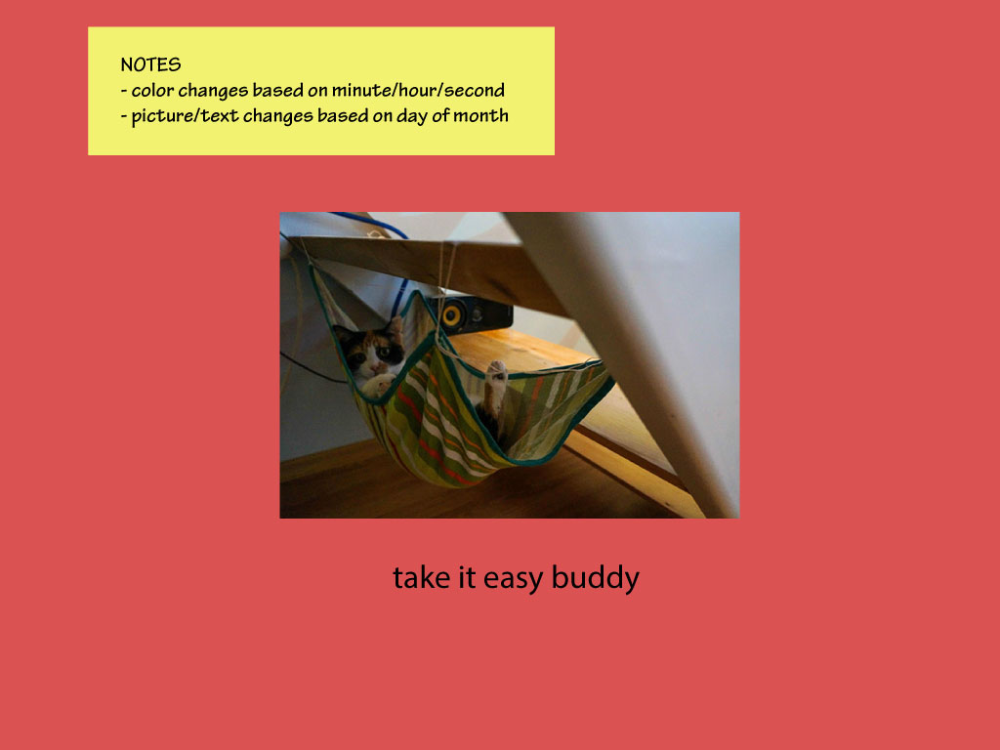
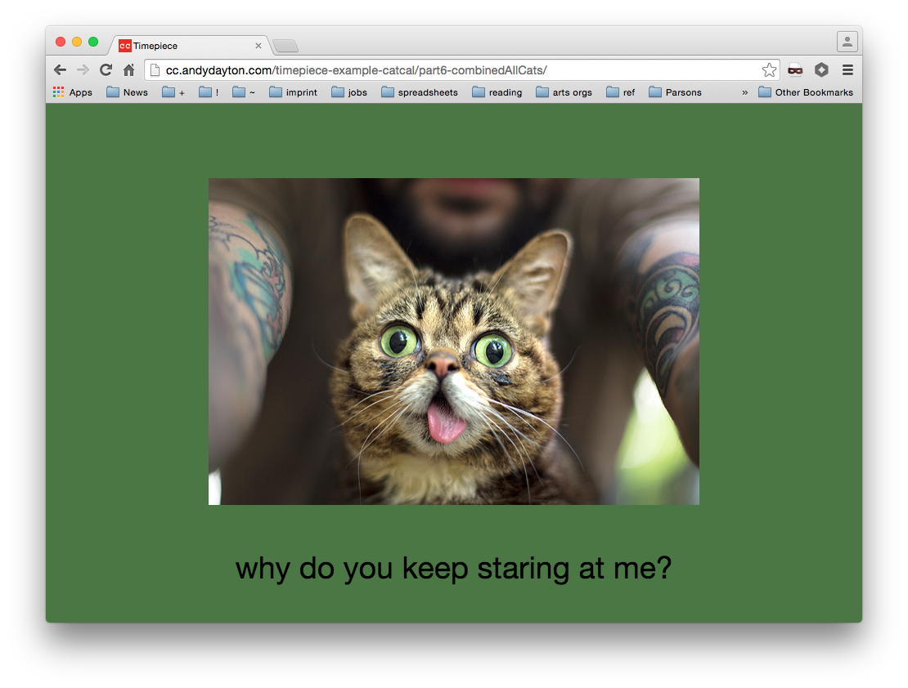

# Cat Calendar (Timepiece Demo)

This is an example project to demonstrate how to plan and prototype the Timepiece project.

## Concept

The goal is to make a "cat calendar" that shows different text, color, and images based on the current date/time.

### Questions

- How do I change the background color?
- How to change the background by time?
- How to show minutes/hours/seconds based on background?
- How to include images to the site?
- How do I change the image based on day of month?
- How to add text?
- How to change text based on day?

## Part 1: Color by Time

Testing out how to have the background color change based on the current time.

- [x]	How do I change the background color?
- [x]	How to change the background by time?
- [x]	How to show minutes/hours/seconds based on background?

 * [View demo](http://cc.andydayton.com/timepiece-example-catcal/part1-colorByTime/)
 * [View code](part1-colorByTime/sketch.js)

## Part 2: Image by Date

Testing out how to load images, and how to have an image display based on the current day of the month.

- [x]	How to include images to the site?
- [x]	How do I change the image based on day of month?

* [View demo](http://cc.andydayton.com/timepiece-example-catcal/part2-catByDate/)
* [View code](part2-catByDate/sketch.js)

## Part 3: Text by Date

This is very similar to part 2, but testing how to show text on the screen based on date.

- [x]	How to add text?
- [x]	How to change text based on day?

* [View demo](http://cc.andydayton.com/timepiece-example-catcal/part3-textByDate/)
* [View code](part3-textByDate/sketch.js)

## Part 4: Text by Date (using the p5.dom addon)

In part 3 we were able to add text to the screen, but it didn't look very good! In this alternative prototype of the text aspect, we instead use the [p5.dom](http://p5js.org/reference/#/libraries/p5.dom) addon for p5 to render the text in HTML rather than on the p5.js canvas.

[Learn more about the p5.dom addon here.](https://github.com/processing/p5.js/wiki/Beyond-the-canvas)

- [x]	How to add text?
- [x]	How to change text based on day?

* [View demo](http://cc.andydayton.com/timepiece-example-catcal/part4-textByDateDom/)
* [View code](part4-textByDateDom/sketch.js)

## Part 5: Putting it All Together

Now we combine all of the previous prototypes to see how it all works together.

* [View demo](http://cc.andydayton.com/timepiece-example-catcal/part5-combined/)
* [View code](part4-combined/sketch.js)

## Part 6: Add Remaining Cats

And finally we add more images/text so that we have a different set for each day of the month.

* [View demo](http://cc.andydayton.com/timepiece-example-catcal/part6-combinedAllCats/)
* [View code](part4-combinedAllCats/sketch.js)
